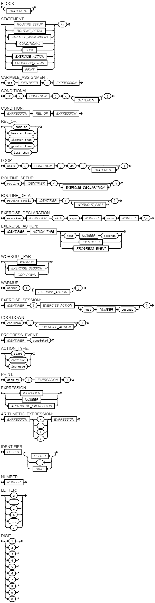

# FIT LANGUAGE
#### Leonardo da França Moura de Andrade

---

## OBJECTIVES
1. Create a Programming Language.
2. The language must have all the basics structures of a programming language: variables, conditions and loops.

---
## DESCRIPTION
1. Motivation: This language was developed to cater specifically to the fitness industry, facilitating the design and management of comprehensive workout programs.
   
2. The language has the following structures:
    - Variables: The user can create variables and assign values to them.
    - Conditions: The user can create conditions to execute a block of code.
    - Loops: The user can create loops to execute a block of code multiple times.
    - Print: The user can print a message to the console.
---

## EBNF
```bash
BLOCK = { STATEMENT } ;
STATEMENT = ( ROUTINE_SETUP | ROUTINE_DETAIL | VARIABLE_ASSIGNMENT | CONDITIONAL | LOOP | EXERCISE_ACTION | PROGRESS_EVENT | PRINT ), "\n" ;


VARIABLE_ASSIGNMENT = "set", IDENTIFIER, "=", EXPRESSION ;

CONDITIONAL = "if", "(", CONDITION, ")", "{", { STATEMENT }, "}" ;
CONDITION = EXPRESSION, REL_OP, EXPRESSION ;
REL_OP = "same as" | "heavier than" | "lighter than" | "greater than" | "less than" ;

LOOP = "while", "(", CONDITION, ")", "do", "{", { STATEMENT }, "}" ;

ROUTINE_SETUP = "routine", IDENTIFIER, "{", { EXERCISE_DECLARATION }, "}" ;
ROUTINE_DETAIL = "routine_detail", IDENTIFIER, "{", { WORKOUT_PART }, "}" ;
EXERCISE_DECLARATION = "exercise", IDENTIFIER, "with", "reps", NUMBER, "sets", NUMBER, "\n" ;
EXERCISE_ACTION = IDENTIFIER, ACTION_TYPE, [ "rest", NUMBER, "seconds" | IDENTIFIER | PROGRESS_EVENT ] ;
WORKOUT_PART = WARMUP | EXERCISE_SESSION | COOLDOWN ;

WARMUP = "warmup", "{", { EXERCISE_ACTION }, "}" ;
EXERCISE_SESSION = IDENTIFIER, "{", EXERCISE_ACTION, [ "rest", NUMBER, "seconds" ], "}" ;
COOLDOWN = "cooldown", "{", { EXERCISE_ACTION }, "}" ;
PROGRESS_EVENT = IDENTIFIER, "completed" ;

ACTION_TYPE = "start" | "continue" | "increase";
PRINT = "display", "(", EXPRESSION, ")" ;


EXPRESSION = IDENTIFIER | NUMBER | ARITHMETIC_EXPRESSION ;
ARITHMETIC_EXPRESSION = EXPRESSION, ("+" | "-" | "*" | "/"), EXPRESSION ;
IDENTIFIER = LETTER, { LETTER | "_" | DIGIT } ;
NUMBER = NUMBER ;
LETTER = ( "a" | "..." | "z" | "A" | "..." | "Z" ) ;
DIGIT = ( "1" | "2" | "3" | "4" | "5" | "6" | "7" | "8" | "9" | "0" ) ;

```
---

### CODE EXAMPLES
```python
routine FullBodyRoutine {
    exercise Pushups with reps 20 sets 3
    exercise Squats with reps 15 sets 4
    exercise Burpees with reps 10 sets 3
}
```

```python
routine_detail FullBodyRoutine {
    warmup {
        Pushups start
        rest 30 seconds
        Pushups continue
        Pushups completed
    }
    exercise_session Squats {
        Squats start
        rest 60 seconds
        Squats continue
        Squats completed
    }
    exercise_session Burpees {
        Burpees start
        rest 45 seconds
        Burpees continue
        Burpees completed
    }
    cooldown {
        display("Cooling down with light stretching.")
        rest 120 seconds
    }
}

```

```python
while (total_reps less than 90) do {
    Pushups start
    set total_reps = total_reps + 20
    rest 60 seconds
    Squats start
    set total_reps = total_reps + 15
    rest 60 seconds
    Burpees start
    set total_reps = total_reps + 10
    rest 60 seconds
}

```


## SYNTAX DIAGRAM

